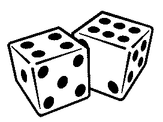

Randomex
========



+/- True Random generator for Elixir

```

Randomex.get_seed
#=> {15926, 11492, 1827}

MobCasApi.apply_seed
#=> :ok

```

Helpers:

```
Randomex.range(0, 100) # Generate random number from "a" to "b" 
#=> 48 

Randomex.range(0, 100)
#=> 15 

Randomex.range(0, 100)
#=> 0

Randomex.range(0, 100)
#=> 100


Randomex.event(60) # Generate true or false for selected percent
#=> true

Randomex.event(60)
#=> true

Randomex.event(60)
#=> false


Randomex.select([1,2,3]) # Select element from list
#=> 1

Randomex.select([1,2,3])
#=> 3

Randomex.select([1,2,3])
#=> 2


Randomex.select([{1,10},{2,1},{3,1}]) # Select element from list, respect weight
#=> 1

Randomex.select([{1,10},{2,1},{3,1}])
#=> 1

Randomex.select([{1,10},{2,1},{3,1}])
#=> 1

Randomex.select([{1,10},{2,1},{3,1}])
#=> 1

Randomex.select([{1,10},{2,1},{3,1}])
#=> 2

Randomex.select([{1,10},{2,1},{3,1}])
#=> 1
```
